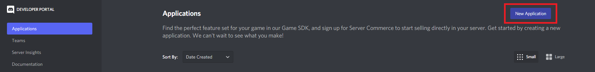
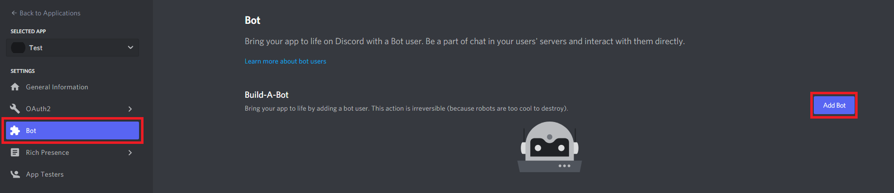
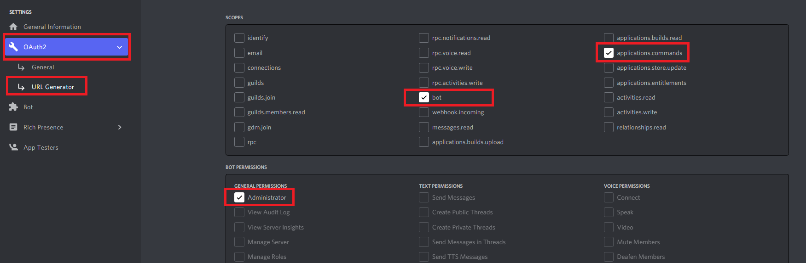
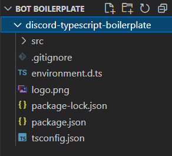
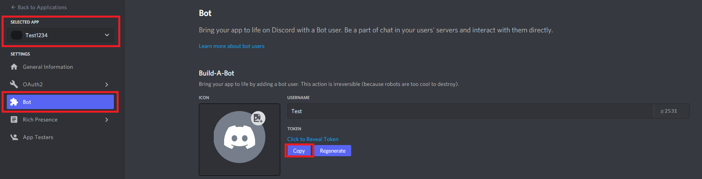

# This is a boilerplate for a discord bot in Typescript
    Do not change the initial code, but feel free to add your own commands and functionalities as updates 
    To set up the bot, follow these steps:

## 1. **[Discord Developer portal](https://discord.com/developers/)**
* Visit the website https://discord.com/developers/
* Create an application by clicking on the `New Application` button <br> </img>
* Click on the application you created, and go to the `Bot` option, and click on `Add Bot` <br> </img>
* Go to `OAuth2` dropdown, and open `URL Generator `, click all the permissions prompted in the image below: <br> </img>
* Now copy the Generated URL, and paste and go in your browser window, and add it to the server you will be using the bot in.

## 2. **Adding the code**
* Fork this repository
* Create an empty directory, and open terminal (preferably open folder in VSCode and use terminal)
* Clone your forked repository (Run this in your terminal ```git clone https://github.com/yourgithub/discord-typescript-boilerplate.git```
* If you followed all steps correctly, you would have something that looks like this: <br></img> 
* Create a file called .env and refer to .env.example file to paste your bot token and client id, you can obtain your bot id in your discord developers portal, in Application > Bot > Copy Token, copy and paste it in the .env file <br> </img> 
* Go to the terminal again and run ```npm i discord.js dotenv glob ```
* Go to the terminal again and run ```npm i -D @types/glob @types/node ts-node ts-node-dev typescript```
* Open your discord, go to settings and enable Developer mode if it isn't already activated since you are here :), after enabling it, right click on the server you want to use, Copy ID and paste it in the .env file, against Guild ID.

## 3. **Checking the bot** 
Go to the terminal and run ```npm start run```

### Your bot is all set up and good to go, you can add more slash commands by adding new js files in the /commands directory, and / or add native commands by adding a new command handler that uses the messageCreate event! (which is now getting slowly deprecated so I would advice you to stick to slash commands!)

### Have fun tinkering 
## Contact me:
* **Created by: [Josh Trivedi](https://joshtrivedi.github.io/portfolio/)**
* **Email: [josh.trivedi@gmail.com](mailto:josh.trivedi@gmail.com)**
* **LinkedIn: [Josh Trivedi](https://www.linkedin.com/in/josh-trivedi/)**
